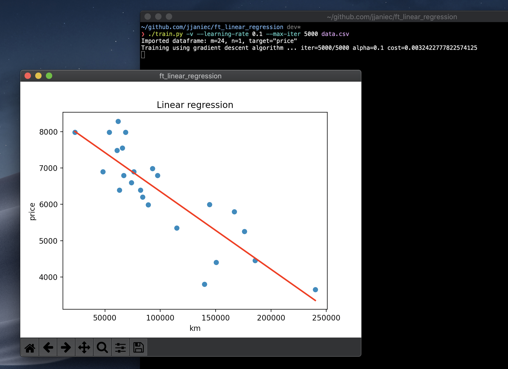

# Ft_linear_regression

Supervised learning introduction



## Setup

```bash
virtualenv venv
source venv/bin/activate
pip install -r requirements.txt
./train.py
./predict.py
```

## Usage

```bash
❯ ./train.py
Usage: train.py [options] dataset_file

Options:
  -h, --help            show this help message and exit
  -v, --visualize       show cost history & regression graph
  -q, --quiet           hides every stdout output
  -a ALPHA, --alpha=ALPHA, --learning-rate=ALPHA
                        train using specified learning rate
  -i MAX_ITER, --max-iter=MAX_ITER
                        train using specified max_iter
  -l, --least-square    train using the least square algorithm (more precise
                        but slow with big datasets)
```

```bash
❯ ./predict.py -h
Usage: predict.py [options] km_value

Options:
  -h, --help            show this help message and exit
  -f FILE, --theta-file=FILE
                        file containing theta values
```

## Propreties

### Dataset

```bash
> cat data.csv
km(feature x1),price(target y)
240000,3650
139800,3800
150500,4400
185530,4450
176000,5250
114800,5350
166800,5800
89000,5990
144500,5999
84000,6200
82029,6390
63060,6390
74000,6600
97500,6800
67000,6800
76025,6900
48235,6900
93000,6990
60949,7490
65674,7555
54000,7990
68500,7990
22899,7990
61789,8290
```

```
m (number of elements in the dataset) = 23
n (number of features / element) = 1
```

### Model

```
f(x) = ax + b
```

### Cost function

```
mean squared error
j(a, b) = (1 / 2m) * (sum of: for i in dataset: (f(xi) - yi) )^2
```

### Error minimisation algorithm

Gradient descent by default
or least square method using the `-l` option on `train.py`
